# Usage example

RamanD2O supplies a small dataset for testing.

## 1. Load data

Just click “Quick start, click here to load a small demo dataset.”, a
small dataset with 25 spectra will be loaded. This dataset can be
grouped using metadata columns “Timepoint” or “Label”. There are three
groups: I245_0mM, I245_0.5mM, and I245_1mM.

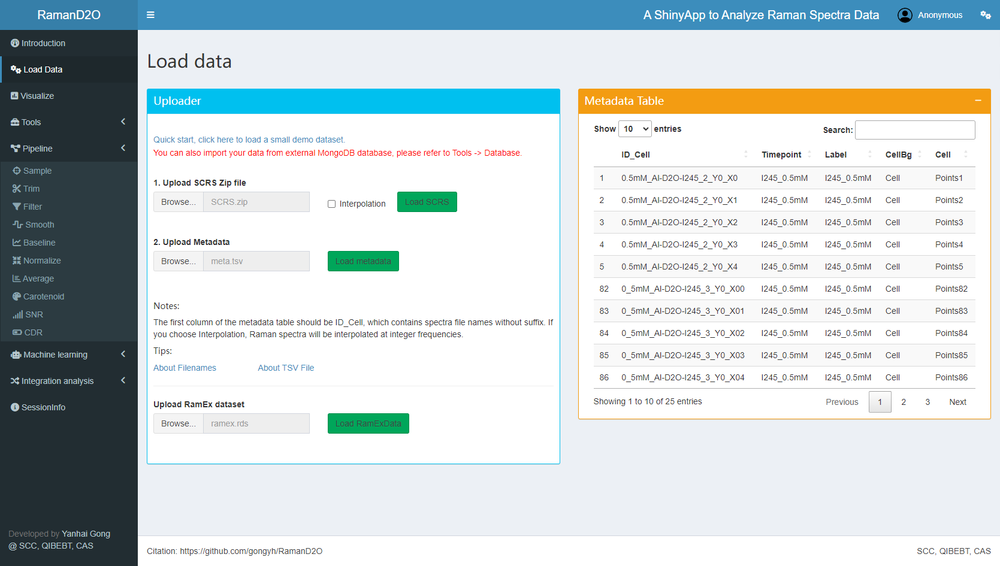

User interface of Data Loader

## 2. Trim wavelength

Raman shift of 450~3100 cm⁻¹ are kept for subsequent analysis.

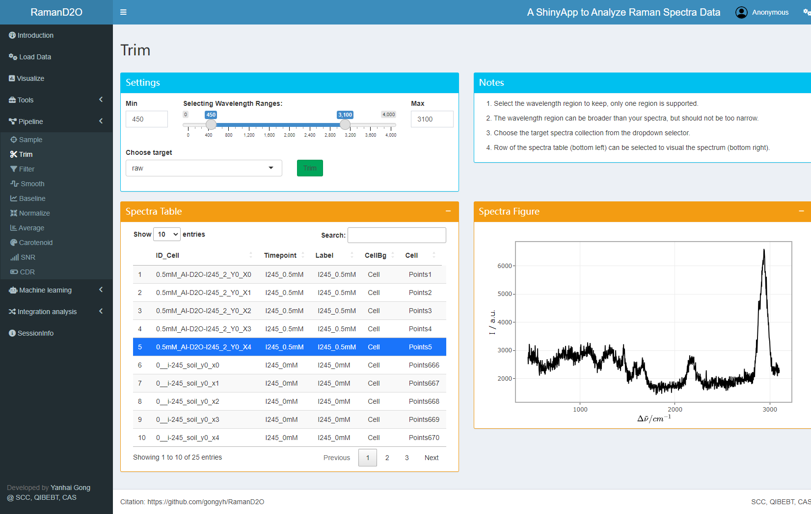

User interface of Trim

## 3. Spectra smoothing

Raman spectra are smoothed using SG method to increase SNR.

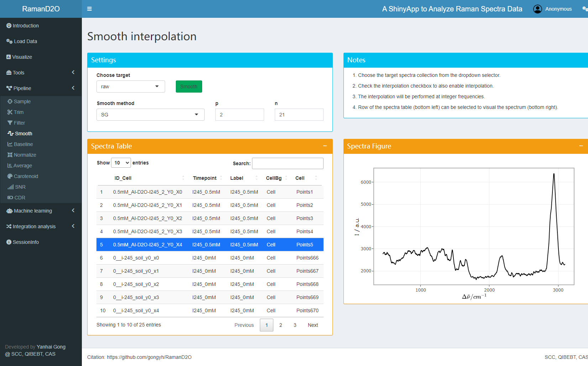

User interface of Smoothing

## 4. Baseline removal

Baselines are removed using als method.

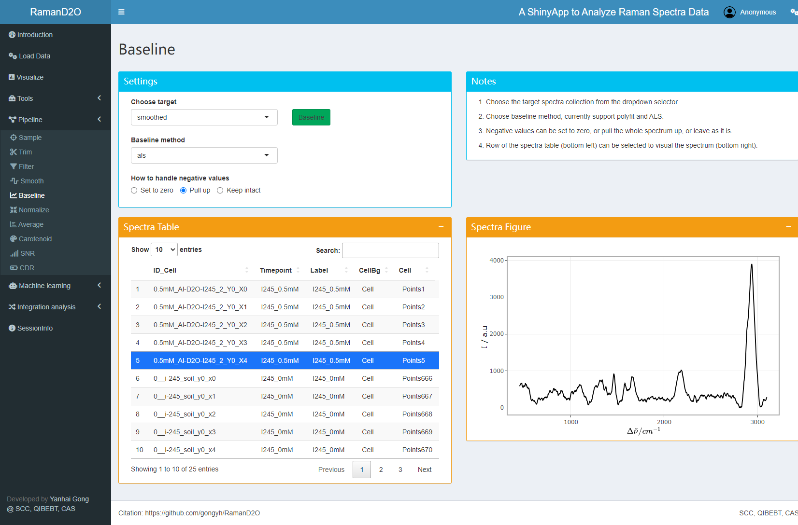

User interface of Baseline removal

## 5. Normalization

Raman spectra are normalized according the area of “Fingerprint” region.

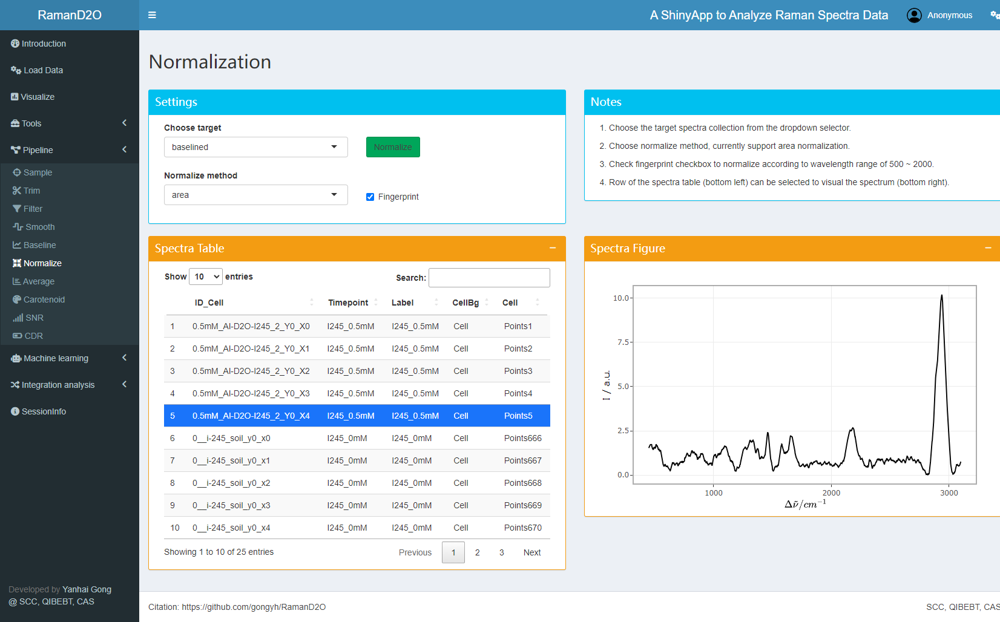

User interface of Normalization

## 6. SNR calculation

SNR of each Raman spectra is calculated using the “new” method. Low-SNR
spectra with SNR\<2.5 are removed.

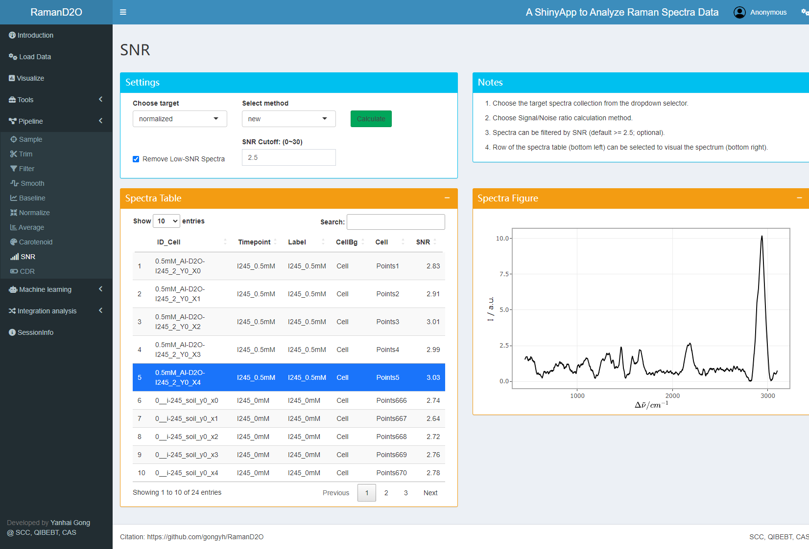

User interface of SNR calculation

## 7. CDR calculation

CDR of each spectra are calculated. As expected, all the spectra have
D2O Raman peaks.

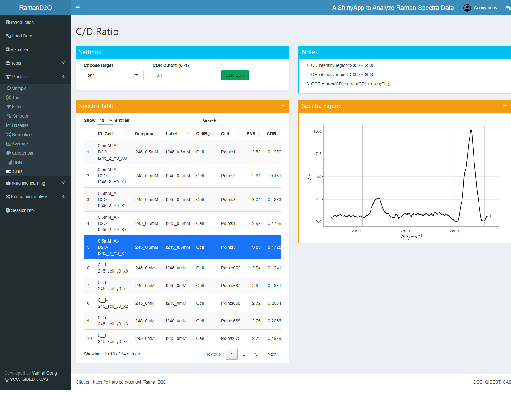

User interface of CDR calculation

## 8. Visualization

The average spectra and CDR can be visualized and compared.

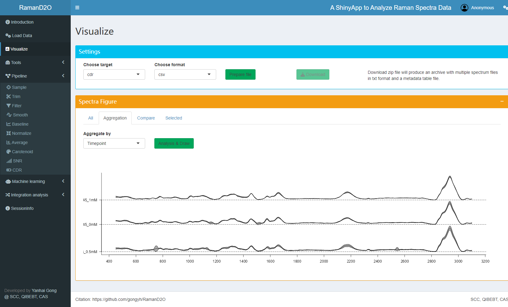

User interface of Visualize

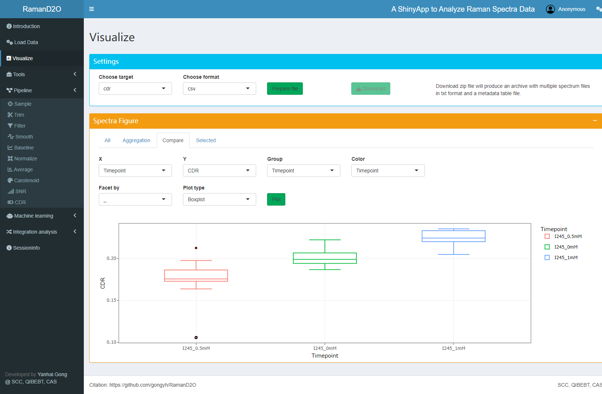

User interface of Visualize

## 9. Multivariable statistics

This Raman spectra dataset can be further mined using multivariable
statistics, e.g., PCA, LDA and MCR.

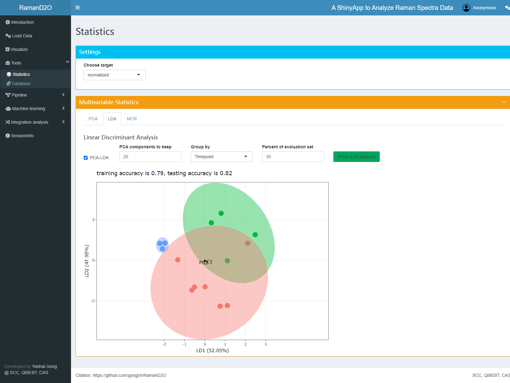

User interface of PCA-LDA

## 10. Machine learning

To test whether Fingerprint region can be used to separate these three
groups, a random forest model is trained and evaluated.

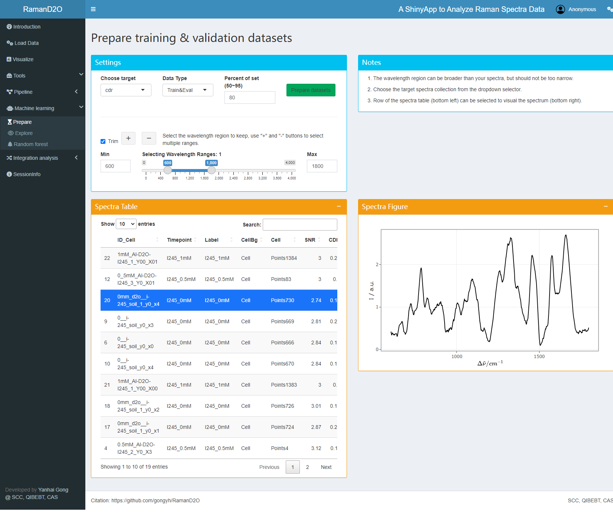

User interface of Machine learning

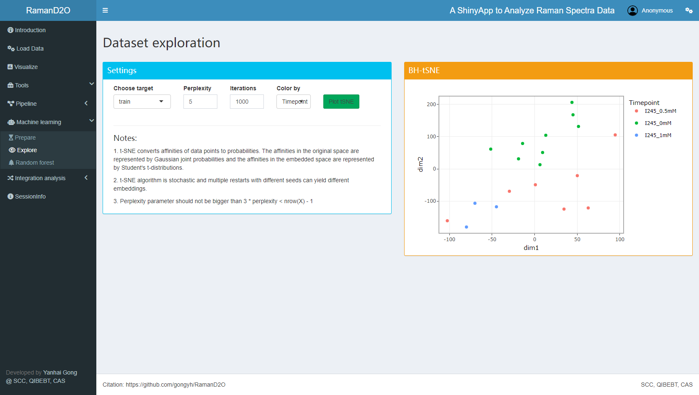

User interface of Machine learning

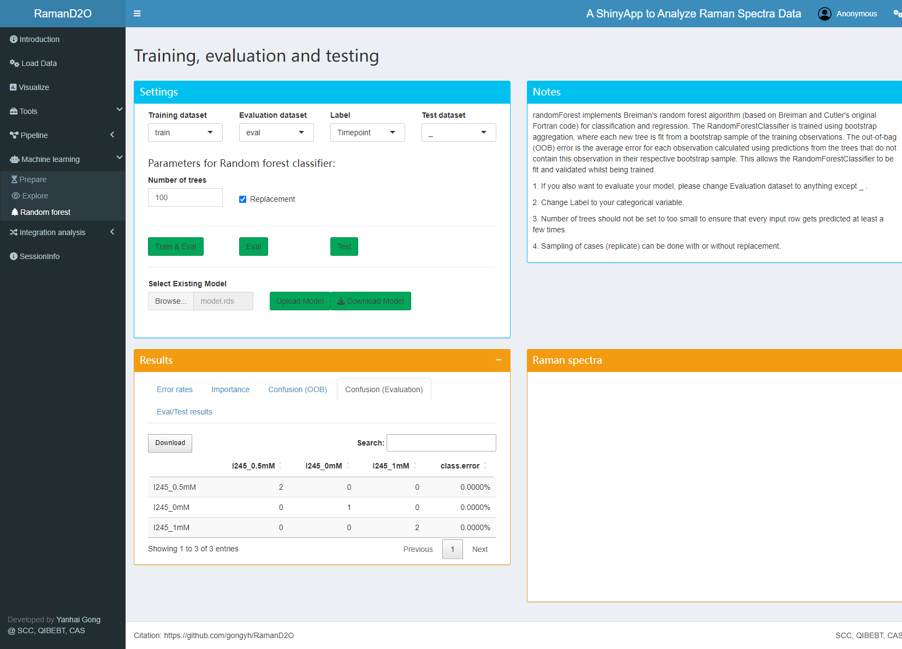

User interface of Machine learning
