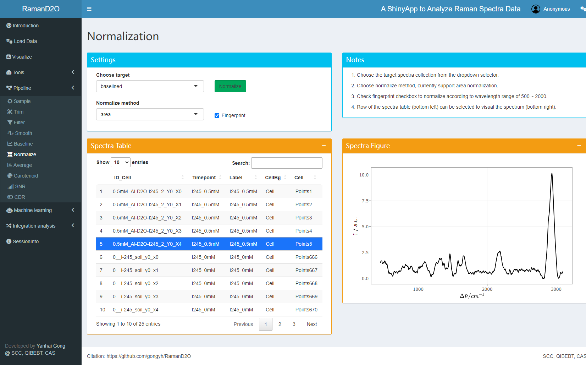

# Usage example

RamanD2O supplies a small dataset for testing.

## 1. Load data

Just click "Quick start, click here to load a small demo dataset.", a small dataset with 25 spectra will be loaded. This dataset can be grouped using metadata columns "Timepoint" or "Label". There are three groups: I245_0mM, I245_0.5mM, and I245_1mM.

## 2. Trim wavelength

Raman shift of 450~3100 cm-1 are kept for subsequent analysis.

## 3. Spectra smoothing

Raman spectra are smoothed using SG method to increase SNR.

## 4. Baseline removal

Baselines are removed using als method.

## 5. Normalization

Raman spectra are normalized according the area of "Fingerprint" region.

## 6. SNR calculation

SNR of each Raman spectra is calculated using the "new" method. Low-SNR spectra with SNR<2.5 are removed.

## 7. CDR calculation

CDR of each spectra are calculated. As expected, all the spectra have D2O Raman peaks.

## 8. Visualization

The average spectra and CDR can be visualized and compared.

## 9. Multivariable statistics

This Raman spectra dataset can be further mined using multivariable statistics, e.g., PCA, LDA and MCR.

## 10. Machine learning

To test whether Fingerprint region can be used to separate these three groups, a random forest model is trained and evaluated.

